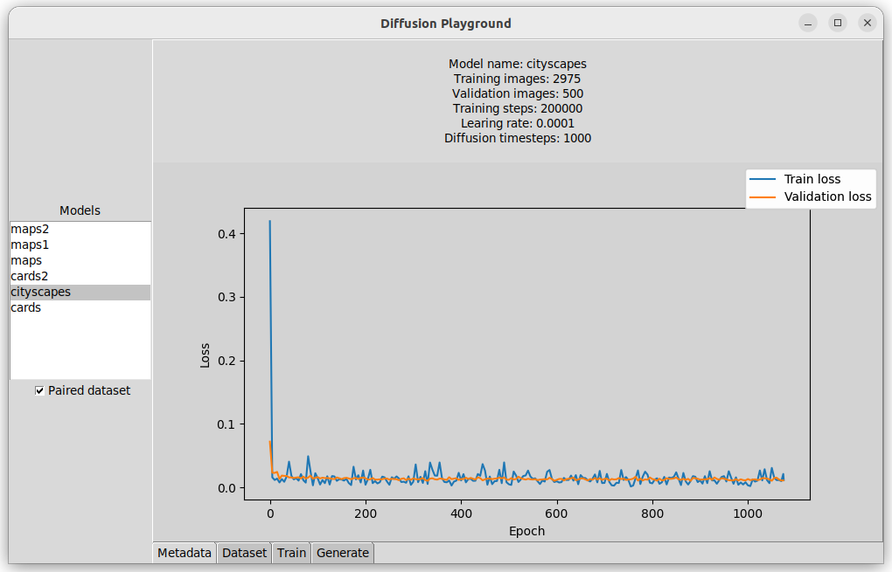
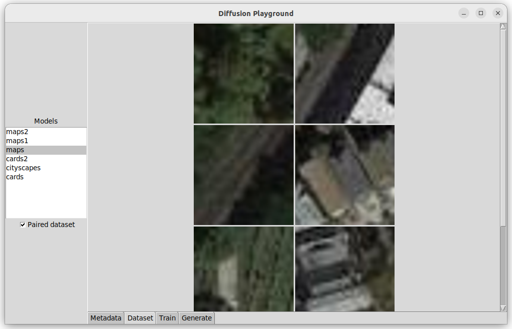
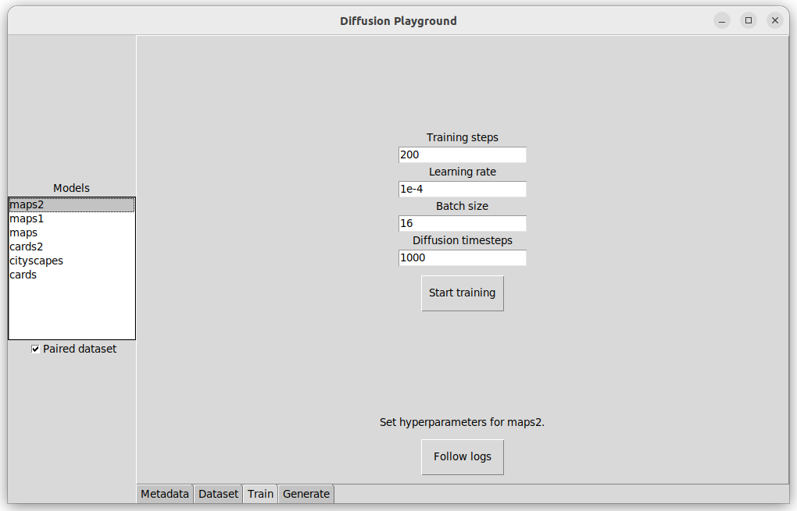
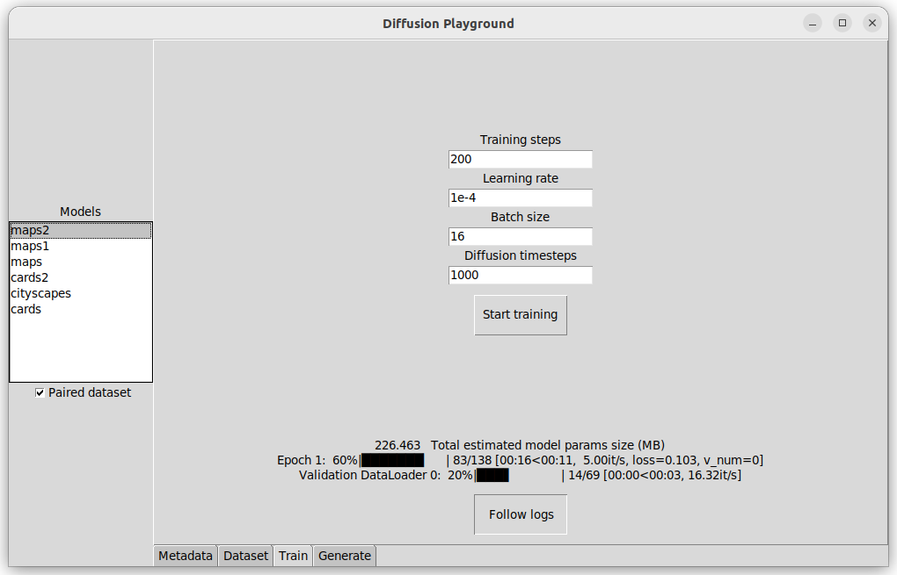
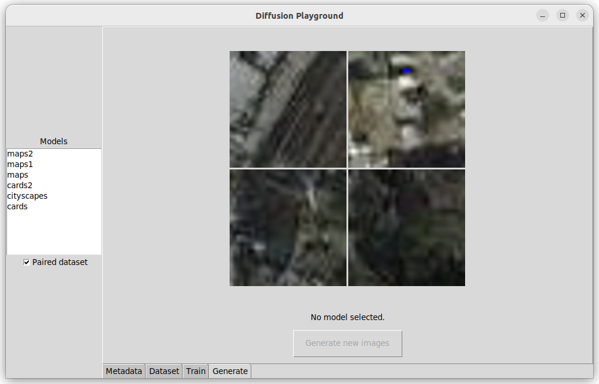

# Diffusion Playground

This is a simple Tkinter UI application for training uncontitioned diffusion models and generating images from them.
Images are generated based on the input dataset.

## Screenshots

Metadata panel shows dataset info, hyperparameters of the model if it's trained, and training/validation loss graph.


On the dataset panel you can see a few images from the dataset. The images are transformed.


Train panel is used to set the hyperparamters and start the model training.


Once the training has been started, the panel will show live logs from the training process.


Finally, after the model is trained, you can generate a sample of images.


## Installation

> You will need at least 8 GB of memory to train a model.

> IF you are running this application from a server, use -X option when establishing a connection: `ssh -X username@server`, so that you can see graphical interface on your computer.

First, create a Python virtual environment. Python 3.10 is recommended.
```
python -m venv venv
source venv/bin/activate
```

Then, install the requirements.
```
pip install -r requirements.txt
```

And finally, run the app from command line:
```
python gui.py
```